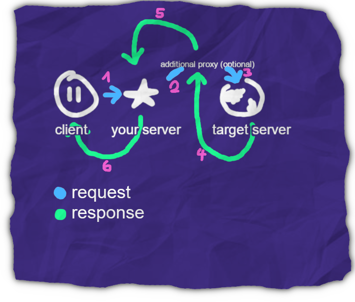

# Reverse Proxy
A very simple reverse proxy for websites and APIs. Mirror any website in seconds, inject CSS and JavaScript, use ad-blocking and more!

## Why?
- **Censorship circumvention:** create a mirror of almost any website in seconds!
- **Privacy:** hide your IP address from the website you're mirroring!
    > - specify **`expose-client-ip: true`** if you want the target website to know the IP address of the client
- **Security:** hide your server's IP address from the public!

## Features

## Supported platforms
- Microsoft **Windows** 10 and higher
- Most newer Debian-based **Linux** distributions

## How?	
- **Install:** `python -m pip install --upgrade -r requirements.txt`
- **Configure:** edit `config.yml`
- **Run:** `python revproxy run-debug`

## Injecting CSS and JavaScript
You can inject custom CSS and JavaScript into the target website, and it's quite easy to do so.
Just create a folder in `inject/` with the domain of the website: `inject/example.com` and put your files in there.
All CSS and JavaScript files in that folder will be injected into the target website.

This allows you to do things like:
- **Dark mode:** if your favorite website doesn't have a dark mode, you can create one yourself!
- **Custom styles:** you can customize the website to your liking!
- **Remove annoying elements:** you can remove annoying elements from the website!

## Ad-blocking & Filter-lists
You can block ads and other elements by modifying the `config/blocklist.txt` file.
Info about the syntax can be found [here](https://help.adblockplus.org/hc/en-us/articles/360062733293-How-to-write-filters).
